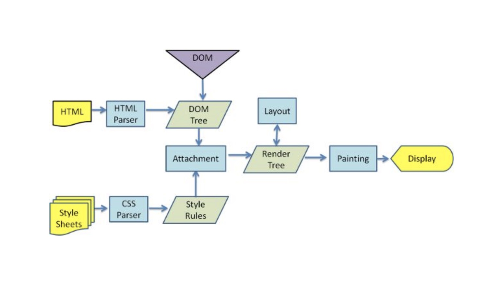
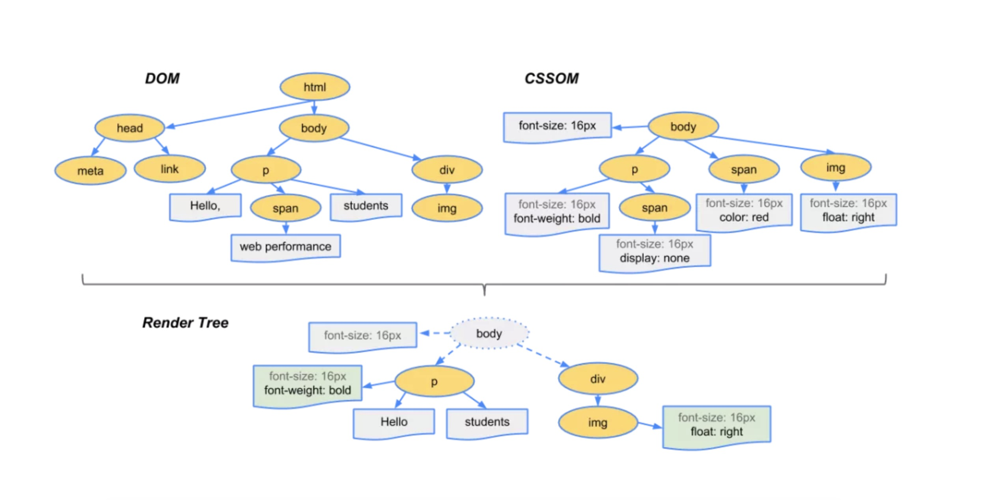
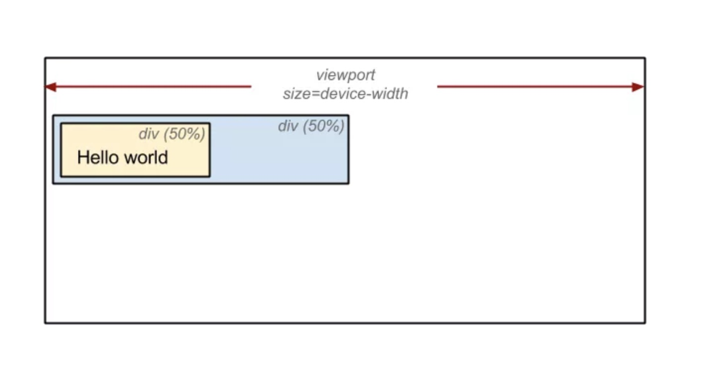

## 回流和重绘

文章摘抄自 [我不是陈纪庚](segmentfault.com/a/1190000017329980) 来源是某公众号。本文只做个人笔记，加深印象。如学习详细内容请移步作者的👉[原文](segmentfault.com/a/1190000017329980)。


### 1. 浏览器的渲染过程



由图可见，浏览器的渲染过程分为以下几步：

1. 解析 `HTML`,生成 `DOM` 树；解析 `CSS`, 生成 `CSSOM` 树。
2. 将 `DOM` 树和`CSSOM` 树结合，生成 `rander tree` （渲染树）。
3. `Layout` (回流):根据生成的渲染树，进行回流(`Layout`)，得到节点的几何信息（位置，大小）
4. `Painting` (重绘):根据渲染树以及回流得到的几何信息，得到节点的绝对像素。
5. `Display`:将像素发送给 **GPU**，展示在页面上。

*其实在第5步中还有很多具体的步骤，但这里先省略，只看浏览器回流和重绘*

***

### 2. 生成 `rander tree` 渲染树



为了构建渲染树，浏览器主要完成了以下工作：

1. 从`DOM`树的根节点开始遍历每个可见节点。
2. 对于每个可见的节点，找到`CSSOM`树中对应的规则，并应用它们。
3. 根据每个可见节点以及其对应的样式，组合生成渲染树。

其中不可见的节点包括：

    1. 一些不会渲染输出的节点，比如 script、meta、link 等。
    2. 一些通过 css 进行隐藏的节点。比如 display:none 。注意，利用 visibility 和 opacity 隐藏的节点，还是会显示在渲染树上的。只有 display:none 的节点才不会显示在渲染树上。

**⚠️注意：渲染树只包含可见的节点。**

***

### 3. `Layout` 回流

前面我们通过构造渲染树，我们将可见 `DOM` 节点以及它对应的样式结合起来，可是我们还需要计算它们在设备视口(viewport)内的确切位置和大小，这个计算的阶段就是回流。

为了弄清每个对象在网站上的确切大小和位置，浏览器从渲染树的根节点开始遍历，我们可以以下面这个实例来表示：

```html
<!DOCTYPE html>
<html>
    <head>
    <meta name="viewport" content="width=device-width initial-scale=1">
    <title>Critial Path: Hello world!</title>
    </head>

    <body>
    <div style="width: 50%">
        <div style="width: 50%">Hello world!</div>
    </div>
</body>
</html>
```

我们可以看到，第一个div将节点的显示尺寸设置为视口宽度的50%，第二个div将其尺寸设置为父节点的50%。而在回流这个阶段，我们就需要根据视口具体的宽度，将其转为实际的像素值（如下图）：



***

### 4. `Painting` 重绘

最终，我们通过构造渲染树和回流阶段，我们知道了哪些节点是可见的，以及可见节点的样式和具体的几何信息(位置、大小)，那么我们就可以将渲染树的每个节点都转换为屏幕上的实际像素，这个阶段就叫做重绘节点。

***

### 5. 何时发生回流重绘

比如以下情况：

- 添加或删除可见的 `DOM` 元素
- 元素的位置发生变化
- 元素的尺寸发生变化（包括外边距、内边框、边框大小、高度和宽度等）
- 内容发生变化，比如文本变化或图片被另一个不同尺寸的图片所替代。
- 页面一开始渲染的时候（这肯定避免不了）

浏览器的窗口尺寸变化（因为回流是根据视口的大小来计算元素的位置和大小的）

**⚠️注意：回流一定会触发重绘，而重绘不一定会回流。**

根据改变的范围和程度，渲染树中或大或小的部分需要重新计算，有些改变会触发整个页面的重排，比如，滚动条出现的时候或者修改了根节点。

***

### 6. 浏览器的优化机制

现代的浏览器都是很聪明的，由于每次重排都会造成额外的计算消耗，因此大多数浏览器都会通过队列化修改并批量执行来优化重排过程。浏览器会将修改操作放入到队列里，直到过了一段时间或者操作达到了一个阈值，才清空队列。但是！**当你获取布局信息的操作的时候，会强制队列刷新**，比如当你访问以下属性或者使用以下方法：

- `offsetTop`、`offsetLeft`、`offsetWidth`、`offsetHeight`

- `scrollTop`、`scrollLeft`、`scrollWidth`、`scrollHeight`

- `clientTop`、`clientLeft`、`clientWidth`、`clientHeight`

- `getComputedStyle()`

- `getBoundingClientRect`

以上属性和方法都需要返回最新的布局信息，因此浏览器不得不清空队列，触发回流重绘来返回正确的值。因此，我们在修改样式的时候，**最好避免使用上面列出的属性，他们都会刷新渲染队列**。如果要使用它们，最好将值缓存起来。

### 7. 最小化重绘和重排

1. 合并多次对DOM和样式的修改，然后一次处理掉

    - 使用 `cssText`
    ```js
    const el = document.getElementById('test');
    el.style.cssText += 'border-left: 1px; border-right: 2px; padding:5px;';
    ```
    - 修改 **CSS** 的 `class`
    ```js
    const el = document.getElementById('test');
    el.className += ' active';
    ```
2. 批量修改 `DOM`
    - 使元素脱离文档流
    - 对其进行多次修改
    - 将元素带回到文档中。

    该过程的第一步和第三步可能会引起回流，但是经过第一步之后，对 `DOM` 的所有修改都不会引起回流，因为它已经不在渲染树了。

    有三种方式可以让 `DOM` 脱离文档流：
    - 隐藏元素，应用修改，重新显示【在展示和隐藏节点的时候，产生两次重绘】
    - 使用文档片段(`document` `fragment`)在当前 `DOM` 之外构建一个子树，再把它拷贝回文档
    - 将原始元素拷贝到一个脱离文档的节点中，修改节点后，再替换原始的元素。【浏览器会使用队列来储存多次修改，进行优化，所以对这个优化方案，我们其实不用优先考虑】
3. 避免触发同步布局事件
4. 对于复杂动画效果，使用绝对定位让其脱离文档流 【元素设置为绝对定位，帧数就可以稳定60】
5. css3硬件加速（GPU加速）
    - 使用css3硬件加速: 可以让`transform`、`opacity`、`filters`这些动画不会引起回流重绘。但是对于动画的其它属性，比如background-color这些，还是会引起回流重绘的，不过它还是可以提升这些动画的性能。

    常见的触发硬件加速的css属性：
    - transform
    - opacity
    - filters
    - Will-change

**⚠️如果你为太多元素使用css3硬件加速，会导致内存占用较大，会有性能问题。在GPU渲染字体会导致抗锯齿无效。这是因为GPU和CPU的算法不同。因此如果你不在动画结束的时候关闭硬件加速，会产生字体模糊。**

