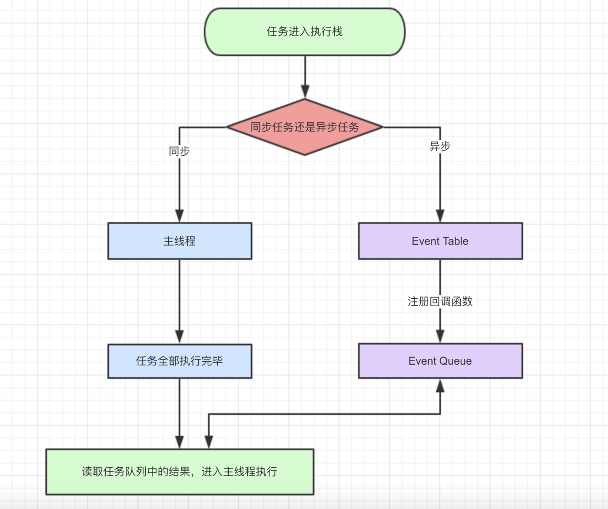
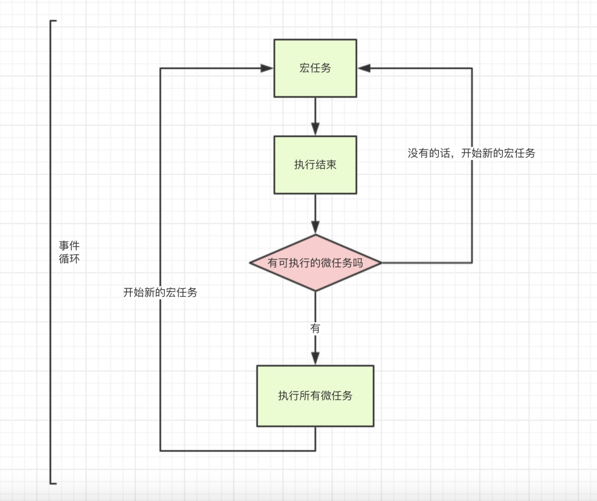

## JS引擎的执行机制


整理一波 js 的执行机制，这波整理其实是在整理 `setTimeout` 和 `setInterval` 这两个函数的具体是怎么执行异步任务时，看了一个 **掘金** 大哥 **ssssyoki** 在2017年写的一篇 ➡️《这一次，彻底弄懂 JavaScript 执行机制》，写的很容易读懂。

原文传送门：[https://juejin.im/post/59e85eebf265da430d571f89](https://juejin.im/post/59e85eebf265da430d571f89)，👈戳一下进原文。

***

复制粘贴开始。。。

作者用一段js引出了这篇文章的核心部分：

```js
setTimeout(function(){
    console.log('定时器开始啦')
});

new Promise(function(resolve){
    console.log('马上执行for循环啦');
    for(var i = 0; i < 10000; i++){
        i == 99 && resolve();
    }
}).then(function(){
    console.log('执行then函数啦')
});

console.log('代码执行结束');
```
依照**js是按照语句出现的顺序执行**这个理念，我自信的写下输出结果：
```js
//"定时器开始啦"
//"马上执行for循环啦"
//"执行then函数啦"
//"代码执行结束"
```
去chrome上验证下。。。结果认知崩塌。。。执行顺序居然不是这样的

### 1.关于javascript
javascript是一门单线程语言，在最新的HTML5中提出了Web-Worker，但javascript是单线程这一核心仍未改变。所以一切javascript版的"多线程"都是用单线程模拟出来的，一切javascript多线程都是纸老虎！

***

### 2.javascript事件循环
既然js是单线程，那就像只有一个窗口的银行，客户需要排队一个一个办理业务，同理js任务也要一个一个顺序执行。如果一个任务耗时过长，那么后一个任务也必须等着。那么问题来了，假如我们想浏览新闻，但是新闻包含的超清图片加载很慢，难道我们的网页要一直卡着直到图片完全显示出来？因此聪明的程序员将任务分为两类：

- 同步任务
- 异步任务

当我们打开网站时，网页的渲染过程就是一大堆同步任务，比如页面骨架和页面元素的渲染。而像加载图片音乐之类占用资源大耗时久的任务，就是异步任务。关于这部分有严格的文字定义，但本文的目的是用最小的学习成本彻底弄懂执行机制，所以我们用导图来说明：



导图要表达的内容用文字来表述的话：

- 同步和异步任务分别进入不同的执行"场所"，同步的进入主线程，异步的进入Event Table并注册函数。
- 当指定的事情完成时，Event Table会将这个函数移入Event Queue。
- 主线程内的任务执行完毕为空，会去Event Queue读取对应的函数，进入主线程执行。
- 上述过程会不断重复，也就是常说的Event Loop(事件循环)。

js引擎存在monitoring process进程，会持续不断的检查主线程执行栈是否为空，一旦为空，就会去Event Queue那里检查是否有等待被调用的函数。

代码示例：

```js
let data = [];
$.ajax({
    url:www.javascript.com,
    data:data,
    success:() => {
        console.log('发送成功!');
    }
})
console.log('代码执行结束');
```
上面是一段简易的ajax请求代码：

- ajax进入Event Table，注册回调函数`success`。
- 执行`console.log('代码执行结束')`。
- ajax事件完成，回调函数`success`进入Event Queue。
- 主线程从Event Queue读取回调函数`success`并执行。

读到这里的时候我重新理解了一下文章一开始的那段js代码，它应该是这样的执行顺序：

```js
//"马上执行for循环啦" (同步任务,被放到主线程里,直接执行打印 console.log('马上执行for循环啦'))
//"代码执行结束" (是同步代码,被放到主线程里,直接执行)
//"定时器开始啦" (异步任务,被放到event table)
//"执行then函数啦" (.then 里的函数是 异步任务,被放到event table)
```
分析的头头有道，应该差不了的！！！

结果又跑一边chrome发现认知又被刷新。。。

**到底怎么回事，我感觉还得继续读下面的文章：**

***

*原文里中间穿插的了一些 `setTimeout` 和 `setInterval` 的知识点，我整理在了上面的 《setTimeout&setInterval》文章里 ，我们先跳过去。。。直接看重点解惑部分！！*

### 3. macro-task(宏任务) 和 micro-task(微任务)

我们进入正题，除了广义的同步任务和异步任务，我们对任务有更精细的定义：

- macro-task(宏任务)：包括整体代码`script`，`setTimeout`，`setInterval`
- micro-task(微任务)：`Promise`，`process.nextTick`

不同类型的任务会进入对应的Event Queue，比如`setTimeout`和`setInterval`会进入相同的Event Queue。

事件循环的顺序，决定js代码的执行顺序。进入整体代码(宏任务)后，开始第一次循环。接着执行所有的微任务。然后再次从宏任务开始，找到其中一个任务队列执行完毕，再执行所有的微任务。听起来有点绕，我们用文章最开始的一段代码说明：

```js
setTimeout(function() {
    console.log('setTimeout');
})

new Promise(function(resolve) {
    console.log('promise');
}).then(function() {
    console.log('then');
})

console.log('console');
```
*悄悄的说，这个代码跟文章前的那个不是一个。。。好吧，不要在意这些细节*

- 这段代码作为宏任务，进入主线程。
- 先遇到`setTimeout`，那么将其回调函数注册后分发到宏任务Event Queue。(注册过程与上同，下文不再描述)
- 接下来遇到了`Promise`，`new Promise`立即执行，`then`函数分发到微任务Event Queue。
- 遇到`console.log()`，立即执行。
- 好啦，整体代码`script`作为第一个宏任务执行结束，看看有哪些微任务？我们发现了`then`在微任务Event Queue里面，执行。
- ok，第一轮事件循环结束了，我们开始第二轮循环，当然要从宏任务Event Queue开始。我们发现了宏任务Event Queue中`setTimeout`对应的回调函数，立即执行。
- 结束。

事件循环，宏任务，微任务的关系如图所示：



好了，我的整理（照搬）就到这里的，其实原文写了跟详细的关于js执行机制的知识点，还有一些拓展，作者的文风也很轻松，一读就懂。